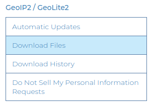

.. _requirements

Requirements
************

This package requires:

- php7.4 or 8.0+
- npm package manager
- MaxmindDB

Download MaxmindDB
==================

To prepare for using this package, you must obtain the MaxMind GeoLite2 Datasets. Here are the steps to follow:

1. Create a MaxMind Account

    Begin by visiting the MaxMind website at `MaxMind Website <https://www.maxmind.com>`_ and proceed to sign up for your account.

2. Log Into Your Account

    After registering, log in to your MaxMind account using your credentials.

3. Access the GeoLite2 Download Page

    Once logged in, navigate to the GeoLite2 download page. You can usually find this in the sidebar menu.

4. Download the Desired Datasets

    On the download page, you will find the following datasets available for direct download:

    - GeoLite2-Country.mmdb
    - GeoLite2-City.mmdb
    - GeoLite2-ASN.mmdb

Simply select the datasets you require and download them to your local environment.

By following these steps, you will have successfully obtained the necessary MaxMind GeoLite2 Datasets to use with this package.   
